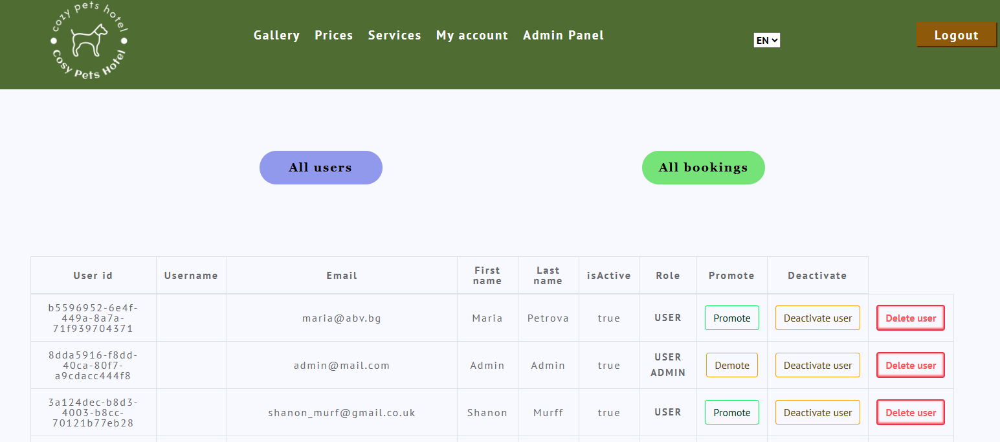

  <h1>CozyPetsHotel</h1>
  
  
Welcome to Cozy Pets Hotel!

Cozy Pets Hotel is a web application, designed to facilitate people with a travelling journey
to provide the highest level of care for their pets, during their absence.

This project utilizes a microservices architecture with REST APIs for communication between services.

## Project Overview

The project consists of two main components:

1. **CozyPetsHotel (Gradle Project)**: The core backend of the platform.
2. **CozyPetsBookings (Gradle Project)**: Manages the bookings.

## Technologies Used

### Back-end:
- **Spring Boot**
- **Spring Data JPA**: For data persistence and repository management
- **Spring Security**: Manages user authentication and authorization.
- **MySQL**: Database to store user data, bookings, and other information.
- **ModelMapper**: For object mapping between DTOs and entities.
- **REST API**: Utilizes RESTful services for communication between the core application and the booking management.

### Front-end:
- **JavaScript**
- **HTML/CSS**
- **Template Engine/Framework**: Uses Thymeleaf for server-side rendering and Bootstrap for styling and responsive design.

## Features

- **User registration and authentication**: Create an account and log in securely.
- **Make bookings**: Choosing dates and entering the correct pet information.
- **Delete bookings**: Cancel the reservation if necessary.
- **Profile Management**: Users and administrators can edit their profiles.
- 
### Database

- **Database**: MySQL.
- **Spring Data JPA**

### Security

- **Spring Security**
- **Roles**: Differentiates between user and administrator roles.

### Validation and Error Handling

- **Validation**: Both client-side and server-side validation mechanisms.
- **Error Messages**: Informative validation messages for users.

## Screenshots

Here are some screenshots of the Dam Platform in action:

- **Home Page**
  

- **Register Page**
  

- **Services Page**
  

- **Gallery Page**
  

- **User Page**
  

- **Admin Page**
  

## Getting Started

To get started with the Cozy Pets Hotel Application, follow these steps:

1. **Clone the Repository**
2. **Navigate to the Project Directory**
3. **Install Dependencies**
   Make sure you have the necessary dependencies installed.
4. **Replace the placeholders**
   To start the project, please replace the placeholders in your configuration file with your actual credentials.
5. **Run the Application**
   Follow the instructions for running the application locally or deploy it to your server.
6. **Access the Platform**
   Open your web browser and navigate to start using the CozyPetsHotel.